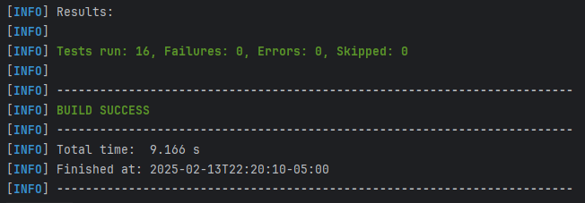

# Taller 3 | AREP

## Web Framework Development with Reflection, IoC Pattern and Meta Protocol Objects

This project implements a framework designed to serve HTML pages and PNG images. It also offers an Inversion of Control (IoC) framework for building web applications from POJOs (Plain Old Java Objects). Additionally, it provides developer tools to define REST services with custom annotations, manage query parameters within requests, specify the location of static files for the server and includes a small web application for planning daily activities.

## Architecture

The architecture used aligns with the Client-Server pattern, in which a server hosts all resources, and one or more clients can access and use these resources through requests that are responded to by the Backend's REST services.


## Getting Started

These instructions will allow you to get a working copy of the project on your local machine for development and testing purposes.

### Prerequisites

- [Java](https://www.oracle.com/co/java/technologies/downloads/) 21 or higher.
- [Maven](https://maven.apache.org/download.cgi). 3.8.1 o higher.
- [Git](https://git-scm.com/downloads) (optional).
- Web Browser.

To check if installed, run:

```
java -version
```
```
mvn --version
```
```
git --version
```

### Installing

1. Download the repository from GitHub in a .zip or clone it to your local machine using Git.

```
git clone https://github.com/jcontreras2693/AREP-Lab2.git
```

2. Navigate to the project directory.

```
cd AREP-Lab2
```

3. Build the project by running the following command:

```
mvn clean compile
```

4. Execute the project with the following command:

```
mvn exec:java -Dexec.mainClass="eci.edu.co.WebApplication"
```
5. The installation process will have been successful if you see a message like this in your command console.


6. Finally, access the address [localhost:35000](http://localhost:35000/) from a web browser to interact with the web application.

Home page example.


Web page employment example.


## Running the Tests

The tests performed verify the getters and setters of the Pokémon class, as well as the Request and Response classes.

To run the tests from the console, use the following command:

```
mvn test
```

If the tests were successful, you will see a message like this in your command console.



## Built With

* [Java Development Kit](https://www.oracle.com/co/java/technologies/downloads/) - Software Toolkit
* [Maven](https://maven.apache.org/) - Dependency Management
* [Git](https://git-scm.com/) - Distributed Version Control System

## Authors

* **Juan David Contreras Becerra** - *Taller 2 | AREP* - [AREP-Lab3](https://github.com/jcontreras2693/AREP-Lab3.git)

## Acknowledgements

* **Billie Thompson** - *README template* - [PurpleBooth](https://github.com/PurpleBooth)
